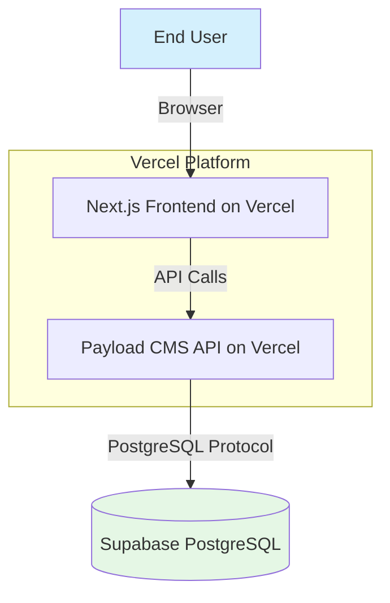

# Creator's Deal Hub Fullstack Architecture Document

## Introduction

[cite\_start]This document outlines the complete fullstack architecture for the Creator's Deal Hub, including backend systems powered by Payload CMS and the Next.js frontend implementation. [cite: 720, 721] [cite\_start]It serves as the single source of truth for AI-driven development, ensuring consistency across the entire technology stack. [cite: 721] [cite\_start]This unified approach combines what would traditionally be separate backend and frontend architecture documents, streamlining the development process. [cite: 722]

### Starter Template or Existing Project

N/A - Greenfield project with an existing backend configuration.

### Change Log

| Date | Version | Description | Author |
| :--- | :--- | :--- | :--- |
| 2025-06-24 | 0.1 | Initial architecture draft | Winston |

## High Level Architecture

### Technical Summary

The system is a full-stack Next.js application featuring a statically generated frontend for performance and a serverless backend for scalability. The frontend will be built with React/Next.js and Tailwind CSS, with interactive 3D graphics managed by Three.js. It integrates with a headless Payload CMS backend, which uses a PostgreSQL database hosted on Supabase. The core architectural pattern is component-based, allowing for the rapid and reusable construction of new pages from a shared library of UI elements.

### High Level Architecture Diagram

This diagram illustrates the primary components and data flow of the system. The user interacts with the Next.js frontend, which fetches content from the Payload CMS API and handles user authentication.

### Architectural and Design Patterns

  * [cite\_start]**Component-Based UI**: We will use React components to create a reusable UI library, which is ideal for maintainability and scalability. [cite: 775]
  * **Headless CMS**: Decoupling the content management (Payload) from the presentation layer (Next.js) allows for greater flexibility and better performance.
  * **Static Site Generation (SSG)**: For content-heavy pages like the blog and marketing pages, we will use SSG for maximum performance and SEO benefits. Dynamic pages will use Server-Side Rendering (SSR) or Client-Side Rendering (CSR) as appropriate.
  * **Route Groups**: The Next.js App Router's route groups (`(frontend)` and `(payload)`) will be used to logically separate the public-facing website from the CMS admin panel, keeping the concerns well-organized.

-----

